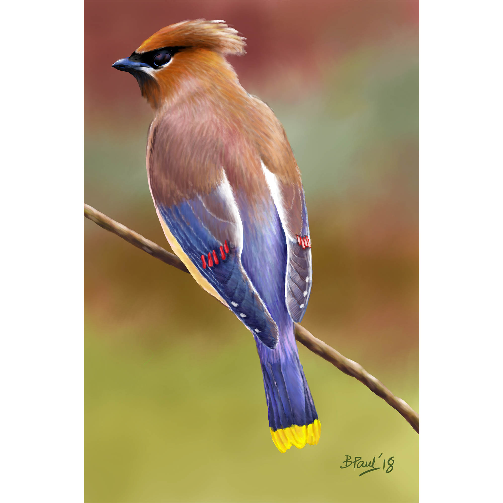
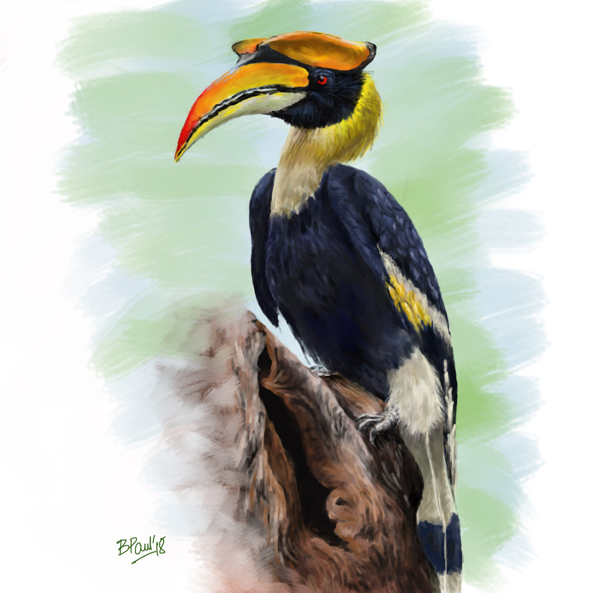
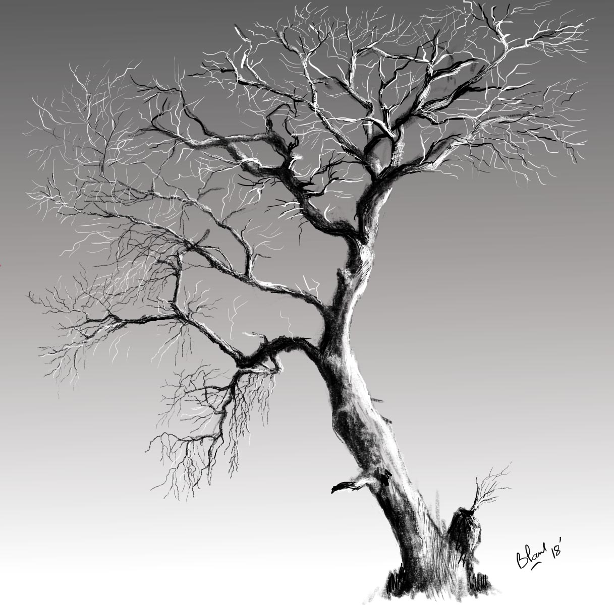
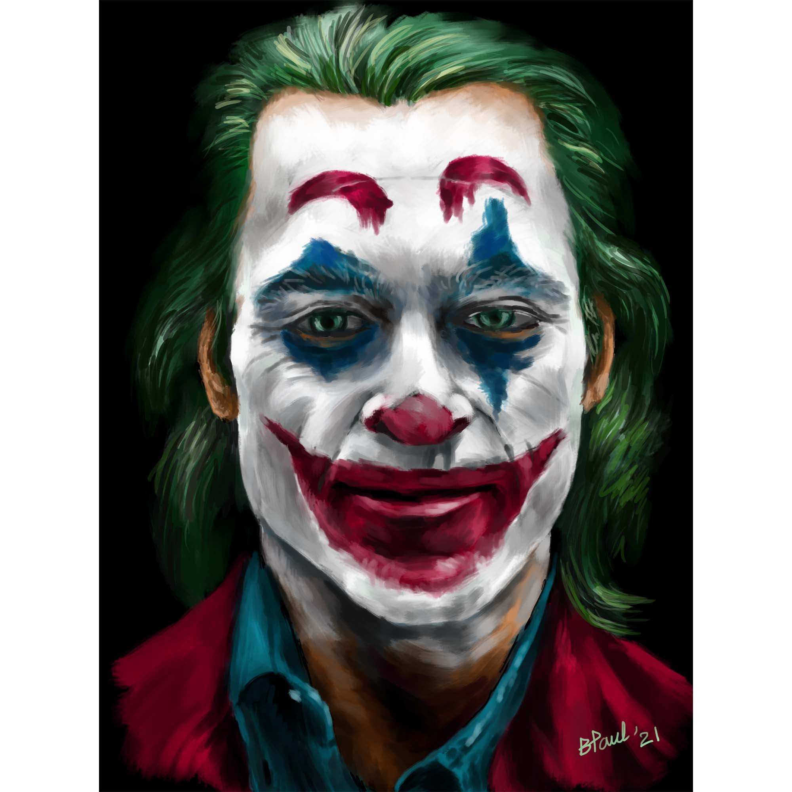

----

## Code

### Application

* **<a href="https://github.com/bishwaruppaul/Flickr_data_download" target="_blank">Flickr_data_download</a>**  
  R code for searching <a href="https://www.flickr.com/" target="_blank">Flickr</a> using keywords and downloading the resulting photos. The date, location, lat-lon and link of the downloaded photos are saved in a text (CSV) file.

* **<a href="https://github.com/bishwaruppaul/instagram_scraper_extension" target="_blank">instagram_scraper_extension</a>**  
  A helper function for the Python package <a href="https://github.com/arc298/instagram-scraper" target="_blank">instagram-scraper</a> by arc298. instagram-scraper lets you download photos from Instagram, and the details of the photos are saved in a JSON file. My code, written in R, extracts the details (filename, location of photo, link) and saves them in a text (CSV) file.

### Tutorial

* **<a href="https://github.com/bishwaruppaul/ggplot2_simple_tutorial" target="_blank">ggplot2_simple_tutorial</a>**  
A simple yet comprehensive tutorial for plotting with 'ggplot2' package in R, created for beginners  
The tutorial presentation can be found in this <a href="https://bishwaruppaul.github.io/ggplot2_simple_tutorial/" target="_blank">link</a>.

### Personal

* **<a href="https://github.com/bishwaruppaul/https://github.com/bishwaruppaul/My-Website_R-project" target="_blank">My-Website_R-project</a>**  
  The R project files for this website. You can fork/download the repository to make your own website, but please use fairly. 

* **<a href="https://github.com/bishwaruppaul/CV_Bishwarup-Paul" target="_blank">CV_Bishwarup-Paul</a>**  
  My CV, made using $\LaTeX$ in <a href="https://www.overleaf.com/" target="_blank">Overleaf</a>  
  The template used is <a href="https://www.overleaf.com/latex/templates/a-customised-curve-cv/mvmbhkwsnmwv" target="_blank">A Customised CurVe CV</a> by LianTze Lim.

----
 

## Digital Illustration
These illustrations were made in either Krita, Medibang Paint or Adobe Illustrator, using One by Wacom drawing tablet.

*Click on the thumbnails to open a full-size image.*
  

:::: {style="display: flex;"} 

::: {.column width="30%"}
<figure>
<figcaption style="text-align: center">Cedar waxwing | 2018</figcaption>

</figure>
:::

::: {.column width="5%"}
:::

::: {.column width="30%"}
<figure>
<figcaption style="text-align: center">Great Hornbill | 2018</figcaption>

</figure>
:::

::: {.column width="5%"}
:::

::: {.column width="30%"}
<figure>
<figcaption style="text-align: center">Common kingfisher | 2018</figcaption>

</figure>
:::

::::

 

:::: {style="display: flex;"} 

::: {.column width="30%"}
<figure>
<figcaption style="text-align: center">Dead tree | 2018</figcaption>

</figure>
:::

::: {.column width="5%"}
:::

::: {.column width="30%"}
<figure>
<figcaption style="text-align: center">Dr. House M.D. | 2020</figcaption>

</figure>
:::

::: {.column width="5%"}
:::

::: {.column width="30%"}
<figure>
<figcaption style="text-align: center">Snow fox | 2021</figcaption>

</figure>
:::

::::

 

:::: {style="display: flex;"} 

::: {.column width="30%"}
<figure>
<figcaption style="text-align: center">Joker | 2021</figcaption>

</figure>
:::

::: {.column width="5%"}
:::

::: {.column width="30%"}
:::

::: {.column width="5%"}
:::

::: {.column width="30%"}
:::

::::

---